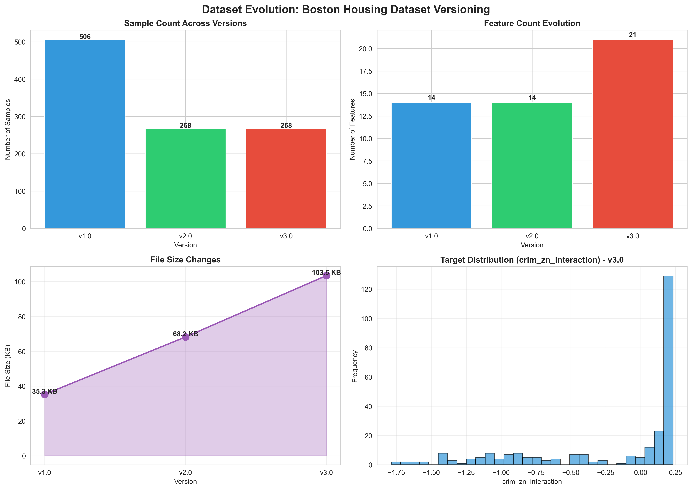
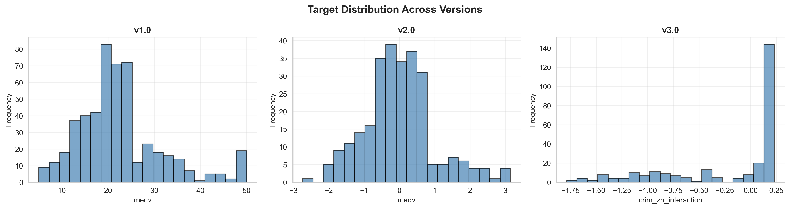

# Boston Housing Dataset - DVC Version Control Lab

This project demonstrates data version control using DVC with cloud storage. Three progressive versions of the Boston Housing dataset are tracked: raw, cleaned, and feature-engineered data.

## What is DVC?

DVC (Data Version Control) is an open-source version control system for ML projects:

- **Data Versioning**: Track changes to datasets across multiple versions
- **Cloud Storage**: Store large files in remote storage (GCS, S3, Azure)
- **Reproducibility**: Recreate any version of data at any point in time
- **Collaboration**: Share datasets efficiently without bloating Git repositories

## Boston Housing Dataset

**Source:** UCI Machine Learning Repository  
**Task:** Regression (predict median home values)  
**Size:** 506 samples, 14 features  
**Target:** MEDV (Median value of homes in $1000s)

### Features

1. CRIM: Per capita crime rate
2. ZN: Proportion of residential land zoned for large lots
3. INDUS: Proportion of non-retail business acres
4. CHAS: Charles River dummy variable
5. NOX: Nitric oxides concentration
6. RM: Average number of rooms per dwelling
7. AGE: Proportion of units built prior to 1940
8. DIS: Weighted distances to employment centres
9. RAD: Index of accessibility to radial highways
10. TAX: Property-tax rate per $10,000
11. PTRATIO: Pupil-teacher ratio by town
12. B: Proportion of Black residents by town
13. LSTAT: Percentage lower status population
14. MEDV: Median home value (TARGET)

## Three Dataset Versions

### v1.0 - Raw Data
- **Samples**: 506
- **Features**: 14
- **Size**: 35 KB
- **Status**: Raw, contains outliers
- **Script**: `scripts/download_data.py`

### v2.0 - Cleaned & Normalized
- **Samples**: 268 (53% retention after outlier removal)
- **Features**: 14
- **Size**: 68 KB
- **Processing**: Removed duplicates, removed outliers (IQR), applied StandardScaler
- **Script**: `scripts/preprocess.py`

### v3.0 - Feature-Engineered
- **Samples**: 268
- **Features**: 21 (14 original + 7 new)
- **Size**: 103 KB
- **New Features**: rm_lstat_interaction, dis_nox_ratio, tax_ptratio_ratio, age_dis_interaction, rm_squared, lstat_squared, dis_squared
- **Script**: `scripts/feature_engineering.py`

## Project Structure

```
DVC_Labs/
├── data/
│   ├── raw/housing_data.csv.dvc
│   ├── processed/housing_data_clean.csv.dvc
│   └── features/housing_data_featured.csv.dvc
├── scripts/
│   ├── download_data.py
│   ├── preprocess.py
│   ├── feature_engineering.py
│   ├── analyze_versions.py
│   └── visualize_evolution.py
├── reports/
│   ├── dataset_stats.json
│   ├── version_comparison.png
│   └── target_distribution.png
└── .dvc/config
```

## Setup

### Prerequisites
- Python 3.8+
- Git
- Google Cloud Platform account with Storage bucket

### Installation

```bash
git clone https://github.com/ManoghnK/MLOps_LabAssignments.git
cd MLOps_LabAssignments/DVC_Labs
python3 -m venv venv
source venv/bin/activate
pip install -r requirements.txt
dvc init
```

### Configure Google Cloud Storage

```bash
dvc remote add -d myremote gs://<bucket>/dvc-storage
dvc remote modify myremote credentialpath <path-to-key.json>
git add .dvc/config
git commit -m "Configure GCS remote"
```

## Running the Pipeline

```bash
# v1.0: Raw data
python scripts/download_data.py
dvc add data/raw/housing_data.csv
git add data/raw/housing_data.csv.dvc
git commit -m "v1.0: Raw data"
git tag v1.0
dvc push

# v2.0: Cleaned
python scripts/preprocess.py
dvc add data/processed/housing_data_clean.csv
git add data/processed/housing_data_clean.csv.dvc
git commit -m "v2.0: Cleaned data"
git tag v2.0
dvc push

# v3.0: Engineered
python scripts/feature_engineering.py
dvc add data/features/housing_data_featured.csv
git add data/features/housing_data_featured.csv.dvc
git commit -m "v3.0: Feature-engineered"
git tag v3.0
dvc push
```

## Switching Versions

```bash
git checkout v1.0 && dvc checkout  # Raw data
git checkout v2.0 && dvc checkout  # Cleaned
git checkout v3.0 && dvc checkout  # Engineered
git checkout main && dvc checkout  # Latest
```

## Common Commands

```bash
dvc status      # Check data status
dvc pull        # Download data
dvc push        # Upload data
dvc diff        # Show version differences
```

## Version Summary

| Version | Samples | Features | Size | Description |
|---------|---------|----------|------|-------------|
| v1.0 | 506 | 14 | 35 KB | Raw data |
| v2.0 | 268 | 14 | 68 KB | Cleaned |
| v3.0 | 268 | 21 | 103 KB | Engineered |

## Generated Reports

### Version Comparison Chart


Visualization showing the evolution of the dataset across all three versions:
- Sample count changes from raw to cleaned data
- Feature count progression with feature engineering
- File size growth through the pipeline
- Visual overview of the complete data transformation workflow

### Target Distribution Analysis


Distribution of the target variable (MEDV - Median Home Value) across all three versions:
- Shows the consistency of target distribution after data cleaning
- Demonstrates that outlier removal and feature engineering maintain data integrity
- Histograms comparing v1.0 (raw), v2.0 (cleaned), and v3.0 (feature-engineered)

### Dataset Statistics (JSON)
`reports/dataset_stats.json` contains detailed statistics for each version:
- Number of samples per version
- Number of features per version
- File size in KB
- Processing descriptions and transformations applied

## Best Practices

✅ Never commit large data files to Git  
✅ Use semantic version tags  
✅ Keep credentials in .gitignore  
✅ Always run `dvc checkout` after `git checkout`  

## Resources

- [DVC Documentation](https://dvc.org/doc)
- [DVC Get Started](https://dvc.org/doc/start)
- [Remote Storage Guide](https://dvc.org/doc/command-reference/remote)

## Author
Manoghn Kandiraju

MLOps Lab Assignment - December 2025

**License:** Educational use only
