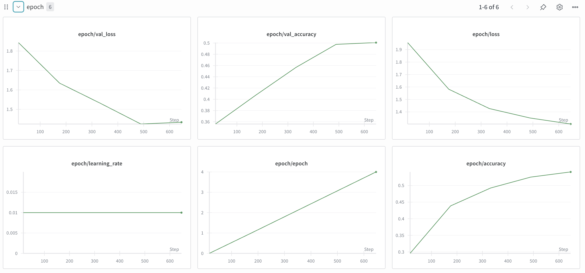
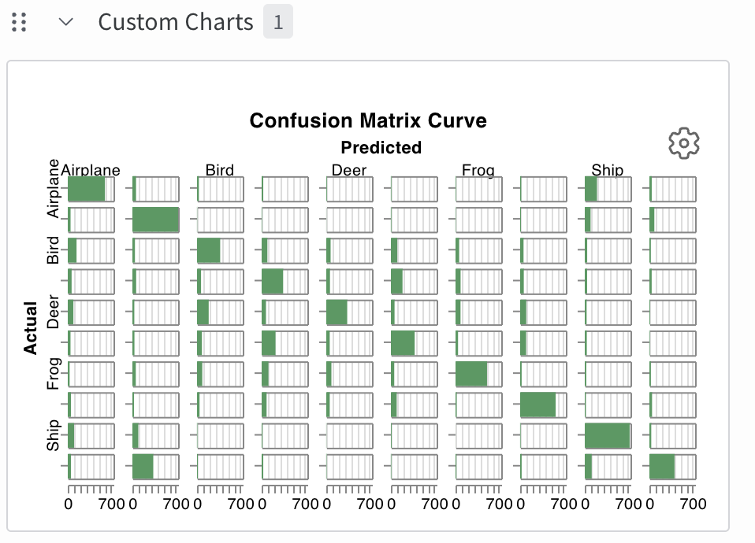

# CIFAR-10 CNN Trainer with Weights & Biases

A CNN-based image classifier for the CIFAR-10 dataset (Fashion_MNIST in the original repo: https://github.com/raminmohammadi/MLOps/blob/main/Labs/Experiment_Tracking_Labs/W%26B/Lab2.ipynb) with comprehensive experiment tracking and visualization using Weights & Biases (W&B).

## Overview

This project trains a Convolutional Neural Network on the CIFAR-10 dataset to classify images into 10 categories: Airplane, Automobile, Bird, Cat, Deer, Dog, Frog, Horse, Ship, and Truck. All training metrics, model checkpoints, and visualizations are automatically logged to W&B for easy monitoring and analysis.

## Features

- **CNN Architecture**: Simple yet effective convolutional neural network with pooling and dropout
- **Real-time Tracking**: Live monitoring of training metrics via W&B dashboard
- **Custom Callbacks**:
  - Learning rate logging per epoch
  - Sample predictions visualization
  - Confusion matrix generation
  - Model checkpointing
- **Artifact Management**: Automatic model saving and versioning
- **Comprehensive Metrics**: Loss, accuracy, validation metrics, and more

## Requirements

```bash
tensorflow>=2.0
wandb
numpy
```

## Installation

```bash
pip install tensorflow wandb numpy
```

## Usage

1. **Login to W&B** (first time only):
```python
wandb.login()
```

2. **Run the training**:
```python
python Lab2.py
```

Or in a Jupyter notebook, simply execute all cells.

## Configuration

Modify the hyperparameters in the `cfg` dictionary:

```python
self.cfg = dict(
    dropout=0.2,         # Dropout rate
    layer_1_size=32,     # Number of filters in Conv layer
    learn_rate=0.01,     # Learning rate
    momentum=0.9,        # SGD momentum
    epochs=5,            # Number of training epochs
    batch_size=64,       # Batch size
    sample=10000,        # Number of samples to use
)
```

## Model Architecture

```
Input (32x32x3)
    ↓
Conv2D (5x5, 32 filters, ReLU)
    ↓
MaxPooling2D (2x2)
    ↓
Dropout (0.2)
    ↓
Flatten
    ↓
Dense (10 classes, Softmax)
```

## Results

### Training Metrics

The model was trained for 5 epochs with the following results:

**Final Performance:**
- **Training Accuracy**: ~56%
- **Validation Accuracy**: ~50%
- **Training Loss**: 1.37
- **Validation Loss**: 1.43

### W&B Dashboard

View the complete training run with interactive visualizations:

**🔗 [W&B Workspace Link](https://wandb.ai/manoghn-northeastern-university/Lab1-visualize-models/runs/mm21g6f0?nw=nwusermanoghn)**

### Visualizations

#### Training Progress

*Real-time batch loss, accuracy, learning rate, and training steps*

#### Epoch Metrics

*Validation loss, validation accuracy, training loss, and training accuracy per epoch*

#### Confusion Matrix

*Final confusion matrix showing model predictions across all CIFAR-10 classes*

### Key Observations

1. **Steady Improvement**: Both training and validation accuracy improve over epochs
2. **No Overfitting**: Training and validation losses remain close, indicating good generalization
3. **Class Performance**: Confusion matrix shows relatively balanced performance across classes
4. **Learning Stability**: Constant learning rate provides stable convergence

## Project Structure

```
.
├── Lab2.ipynb                    # Main training notebook
├── README.md                     # This file
├── artifacts/
│   ├── model.h5                 # Saved model
│   └── model_summary.txt        # Model architecture summary
└── checkpoints/
    └── model-{epoch}.h5         # Per-epoch checkpoints
```

## Custom Callbacks

### 1. LogLRCallback
Logs the current learning rate at the end of each epoch.

### 2. LogSamplesCallback
Creates a table with sample predictions, showing:
- Input images
- True labels
- Predicted labels
- Correctness indicator
- Prediction confidence

### 3. ConfusionMatrixCallback
Generates and logs a confusion matrix on the validation set after each epoch.

## Customization

### Change Dataset
To use a different dataset, modify the `_prepare_data()` method:

```python
def _prepare_data(self):
    from tensorflow.keras.datasets import mnist
    (xtr, ytr), (xte, yte) = mnist.load_data()
    # Update preprocessing for grayscale images
```

### Modify Architecture
Update the `_build_model()` method to experiment with different architectures:

```python
def _build_model(self):
    inputs = k.Input(shape=(32, 32, 3))
    # Add more layers
    x = k.layers.Conv2D(64, (3,3), activation="relu")(inputs)
    x = k.layers.Conv2D(64, (3,3), activation="relu")(x)
    # ... rest of architecture
```

### Adjust Training
Modify hyperparameters in the config dictionary or add new callbacks:

```python
callbacks = [
    WandbMetricsLogger(log_freq=10),
    WandbModelCheckpoint(...),
    k.callbacks.EarlyStopping(patience=3),  # Add early stopping
    k.callbacks.ReduceLROnPlateau(),        # Add LR scheduling
]
```


## Acknowledgments

- CIFAR-10 dataset: [Learning Multiple Layers of Features from Tiny Images](https://www.cs.toronto.edu/~kriz/cifar.html)
- Weights & Biases for experiment tracking
- TensorFlow/Keras for deep learning framework